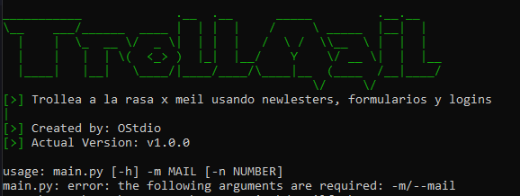
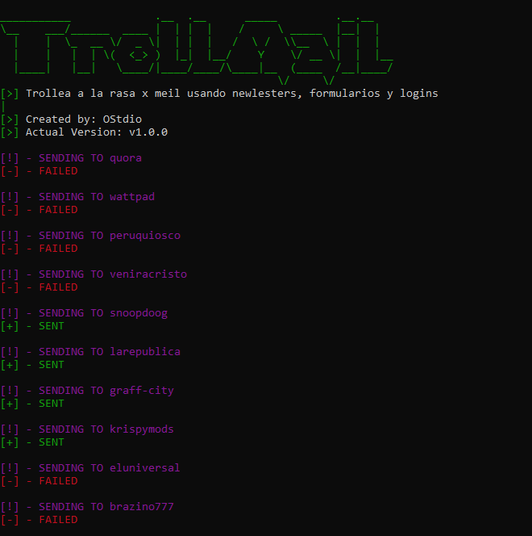

# TrollMail

script hecho en python el cual te inscribe a paginas web mediante una request post

## Disclaimer

el mal uso de este script no es responsabilidad de los creadores y no nos hacemos responsables del daño que hagan con el mismo.

## Uso

el uso de esta herramienta es simple

### 1

instalas las dependencias que estan dentro del archivo "requirements.txt"

```bash
pip install -r requirements.txt
```

### 2

despues corres el script con python

```bash
python main.py 
```

y te va aparecer esta pequeña ayuda indicandote los argumentos



los agumentos son los siguientes:

```text
-h (OPCIONAL) -> menu de ayuda
-m (OBLIGATORIO) -> el mail a atacar
-n (OPCIONAL) -> el numero a ataca, este proporciona acceso a mas paginas
```

ejemplo de como seria un ataque a un mail:

```bash
python ./main.py -m johndoe@domain.com
```


